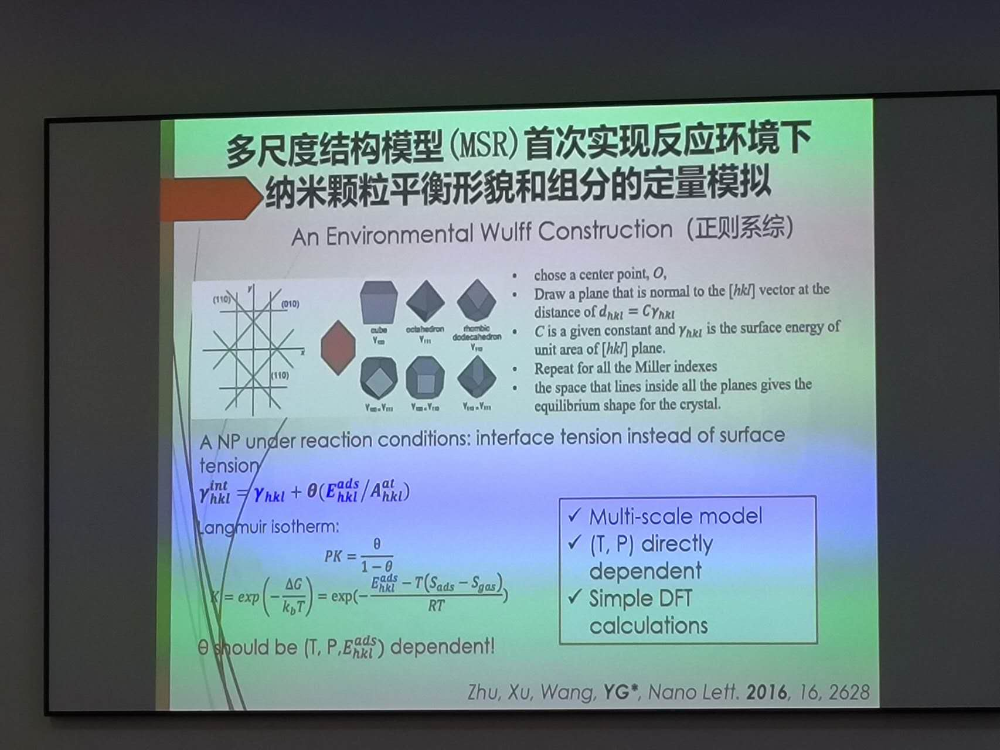

From April 9th to 10th, I visited the **Shanghai Institute of Applied Physics** and the **Shanghai Synchrotron Radiation Facilities (SSRF)**, and held academic discussions with scientists and researchers on issues such as electrocatalysis, in-situ characterization, and new energy batteries.

Shanghai Institute of Applied Physics
======

Synchrotron Radiation Facilities
======

Acadamic discussion in Shanghai Institute of Applied Physics
===

Group photo of the Talented Program and Professors in SSRF
======

I was the fourth one from the right (in 1st row)
