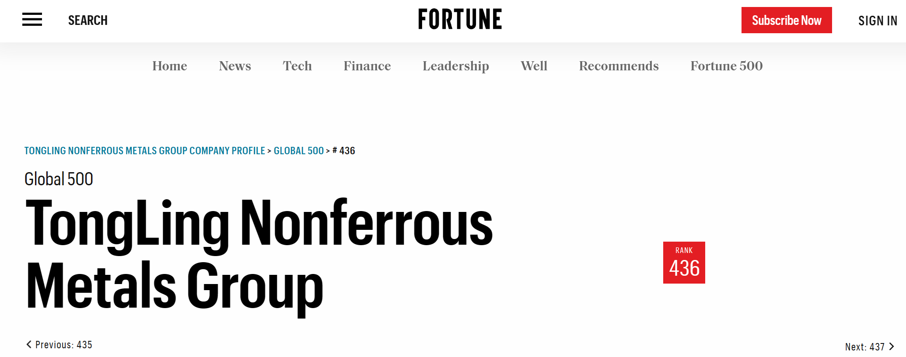

On July 6, 2022, as a member of Professor Zeng Jie’s team in USTC, I participated in a symposium with Tongling Nonferrous Metals Group Co., Ltd.，where I presented my research results of **Continuous Controllable Mass Production of Monodispersed Cu NCs in fluid device.** 

Tongling Nonferrous Metal Group Co., Ltd.
======

Heading 2
======

Heading 3
======
