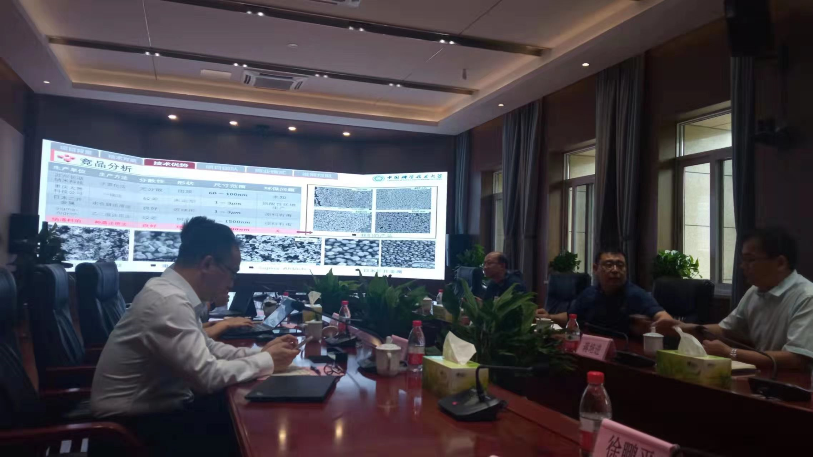

On July 6th, 2022, as a member of Professor Zeng Jie’s team in USTC, I participated in a symposium with Tongling Nonferrous Metals Group Co., Ltd.，where I presented my research program **Continuous Controllable Mass Production of Monodispersed Cu NCs in fluid device** and discussed the prospects of collaboration.

Global Ranking 
======

Tongling Nonferrous Metals Group Co., Ltd. is the 436th in the Fortune Global 500 Companies, 2023

Group Photo
======

A group photo of the participants. I was the first one from the left, and Prof. Jie Zeng was the fourth one from the left(in the middle).

Symposium
======

Photo shot on the Symposium. I was presenting my research results.
